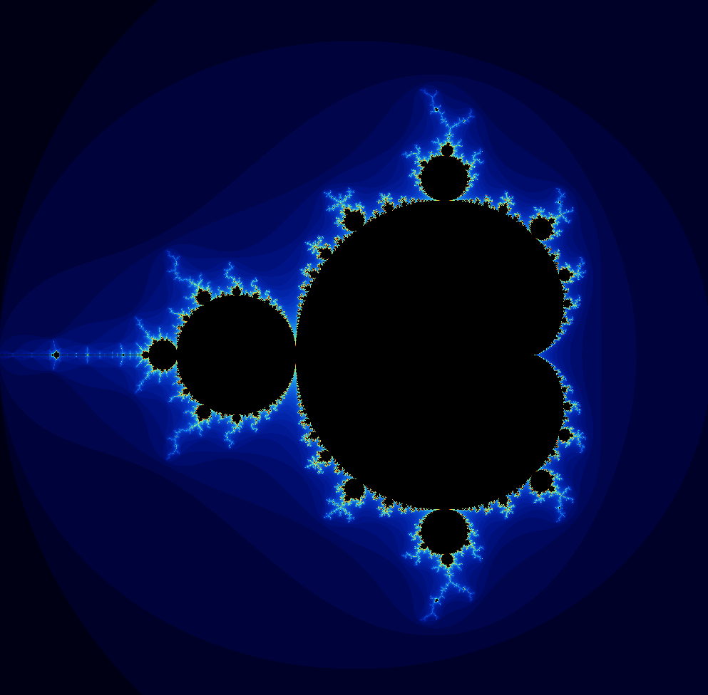

# Mandelbrot Set Visualization with Raylib

This project visualizes the Mandelbrot set using the Raylib library. It calculates and renders the fractal on a window, showcasing the beauty of complex number mathematics.

## Description

The Mandelbrot set is a famous fractal that is defined as the set of complex numbers `c` for which the function `f(z) = z^2 + c` does not diverge when iterated from `z = 0`. This project uses a custom `Complex` class to perform the necessary complex number calculations and Raylib to handle graphics rendering.

## Features

- Visualization of the Mandelbrot set.
- Smooth color transitions based on iteration counts.
- Uses a custom complex number class for calculations.

## Getting Started

### Prerequisites

- C++ compiler (e.g., GCC, Clang, MSVC)
- [Raylib](https://www.raylib.com/) library
- [Visual Studio Code](https://code.visualstudio.com/)
- [Raylib-CPP Starter Template](https://github.com/educ8s/Raylib-CPP-Starter-Template-for-VSCODE)

### File Structure

- `main.cpp`: Contains the main logic for rendering the Mandelbrot set.
- `complex.h`: Defines the `Complex` class used for complex number calculations.

### Example Output

## Future Development

Future development of this project will focus on implementing continuous zooming into the Mandelbrot set, similar to the zoom effects seen in popular Mandelbrot set visualizations.
